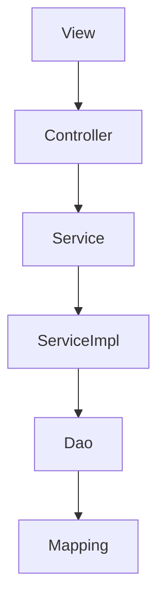

> SSM包含持久层Dao和Model，业务层Service和ServiceImpl，表现层Controller和View，本文讲述这些不同层的作用和关系。
<!--more-->

 ## 持久层：Dao层（mapper）

> DAO层主要是做数据持久层的工作，负责与数据库进行联络的一些任务都封装在此

* DAO层的设计首先是设计DAO的接口
* 然后在Spring的配置文件中定义此接口的实现类
* 然后就可在模块中调用此接口来进行数据业务的处理，而不用关心此接口的具体实现类是哪个类，显得结构非常清晰
* DAO层的数据源配置，以及有关数据库连接的参数都在Spring的配置文件中进行配置

## 业务层：Service层
> Service层主要负责业务模块的逻辑应用设计

* 首先设计接口，再设计其实现的类
* 接着再在Spring的配置文件中配置其实现的关联。这样我们就可以在应用中调用Service接口来进行业务处理
* Service层的业务实现，具体要调用到已定义的DAO层的接口
* 封装Service层的业务逻辑有利于通用的业务逻辑的独立性和重复利用性，程序显得非常简洁

## 表现层：Controller层（Handler）
> Controller层负责具体的业务模块流程的控制

* 在此层里面要调用Service层的接口来控制业务流程
* 控制的配置也同样是在Spring的配置文件里面进行，针对具体的业务流程，会有不同的控制器，我们具体的设计过程中可以将流程进行抽象归纳，设计出可以重复利用的子单元流程模块，这样不仅使程序结构变得清晰，也大大减少了代码量

## View层
* View层：此层与控制层结合比较紧密，需要二者结合起来协同工发。View层主要负责前台jsp页面的表示.

## 各层联系

* DAO层，Service层这两个层次都可以单独开发，互相的耦合度很低，完全可以独立进行，这样的一种模式在开发大项目的过程中尤其有优势
* Controller，View层因为耦合度比较高，因而要结合在一起开发，但是也可以看作一个整体独立于前两个层进行开发。这样，在层与层之前我们只需要知道接口的定义，调用接口即可完成所需要的逻辑单元应用，一切显得非常清晰简单
* Service层是建立在DAO层之上的，建立了DAO层后才可以建立Service层，而Service层又是在Controller层之下的，因而Service层应该既调用DAO层的接口，又要提供接口给Controller层的类来进行调用，它刚好处于一个中间层的位置。每个模型都有一个Service接口，每个接口分别封装各自的业务处理方法

## 总结：
view层：结合control层，显示前端页面

control层：业务模块流程控制，调用service层接口

service层：业务操作实现类，调用dao接口

dao层：数据业务处理，持久化操作

model层：pojo， or mapping，持久层

 

<i>Lastly, welcome to follow me on [github](https://github.com/fakeYanss)</i>
